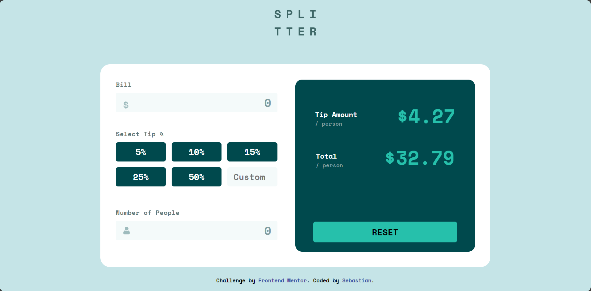
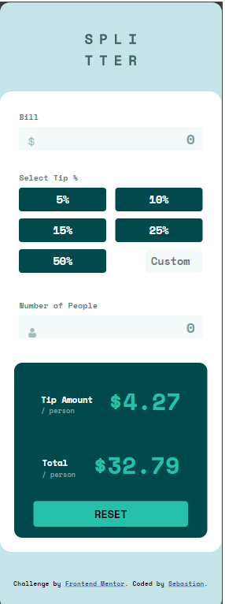

# Frontend Mentor - Tip calculator app solution

This is a solution to the [Tip calculator app challenge on Frontend Mentor](https://www.frontendmentor.io/challenges/tip-calculator-app-ugJNGbJUX). Frontend Mentor challenges help you improve your coding skills by building realistic projects.

## Table of contents

- [Overview](#overview)
  - [The challenge](#the-challenge)
  - [Screenshot](#screenshot)
  - [Links](#links)
- [My process](#my-process)
  - [Built with](#built-with)
  - [What I learned](#what-i-learned)
  - [Continued development](#continued-development)
- [Author](#author)

## Overview

### The challenge

Users should be able to:

- View the optimal layout for the app depending on their device's screen size
- See hover states for all interactive elements on the page
- Calculate the correct tip and total cost of the bill per person

### Screenshot

### Links

- Solution URL: [Github repository](https://github.com/SebBudynski/tip-calculator)
- Live Site URL: [Netlify live site](https://tip-calculator-sebastian.netlify.app/)

## My process

### Built with

- Semantic HTML5 markup
- CSS custom properties
- Flexbox
- SCSS preprocesor

### What I learned

This project was a real game-changer for me! I got to dive deeper into some cool advanced JS stuff and seriously level up my SCSS skills. Getting started with node-sass was a bit of a workout, but totally worth it in the end.

### Continued development

For my next project, I'm planning to polish up the skills I've already picked up. It's all about getting better, one step at a time!

## Author

- Frontend Mentor - [@SebBudynski](https://www.frontendmentor.io/profile/SebBudynski)

